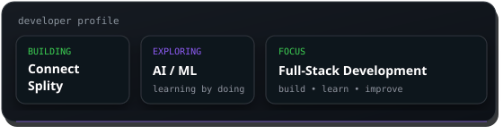
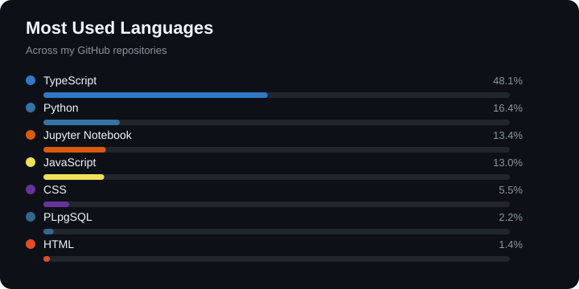
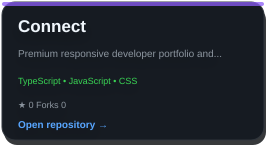
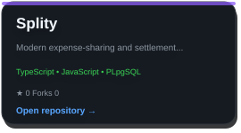
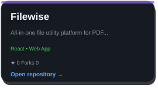
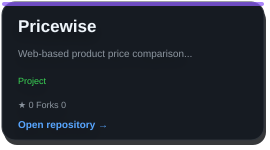
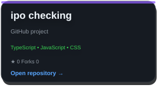
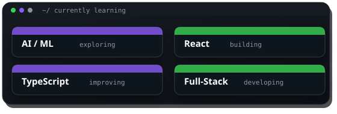

<h1>Yash Bajaj</h1>

  

---

## ~/ whoami

Hi, I am **Yash Bajaj**, a CSE (AI) student who enjoys building full-stack applications and exploring AI/ML.

I like turning ideas into real projects and learning by building.

## ~/ tech stack

**Frontend**

**Backend**

**Database**

**Tools & Platforms**

---

## ~/ github activity

---

## ~/ selected work

<!-- PROJECTS:START -->
<table>
<tr><td align="center"></td><td align="center"></td></tr>
<tr><td align="center"></td><td align="center"></td></tr>
<tr><td align="center"></td><td align="center"></td></tr>
</table>
<!-- PROJECTS:END -->

---

## ~/ currently learning

---

## ~/ leetcode

---

`$ echo "thanks for visiting"`

### Thanks for visiting!

