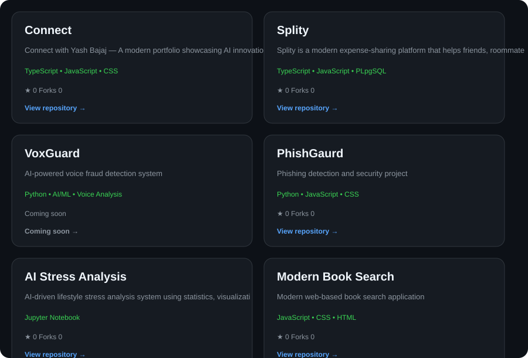

  

  

---

## ~/ whoami

Hi, I am **Yash Bajaj**, a CSE (AI) student who enjoys building full-stack applications and exploring AI/ML.

I like turning ideas into real projects and learning by building.

- Building **Connect**
- Building **Splity**
- Exploring **AI/ML**
- Improving my full-stack development skills

## ~/ tech stack

**Frontend** — React · Tailwind · HTML · CSS · JavaScript · TypeScript

**Backend** — Node.js · Express

**Database** — PostgreSQL · Supabase

**Cloud & Services** — Cloudinary

**Tools & Platforms** — Git · GitHub · VS Code · Linux · Postman

---

## ~/ github activity

---

## ~/ selected work

---

## ~/ currently learning

`AI/ML` `React` `TypeScript` `Full-Stack Development`

### Thanks for visiting!

