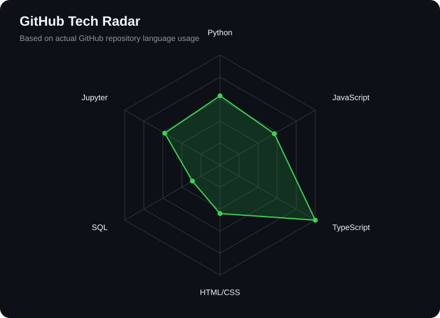

<div align="center">


<br>

<a href="https://github.com/yashbajaj02">
  
</a>

<br>

<a href="https://linkedin.com/in/yashbajaj02"></a>
<a href="mailto:bajajyash06@gmail.com"></a>
<a href="https://connectyash.vercel.app/"></a>
<a href="https://leetcode.com/u/yashbajaj02/"></a>

<br>


</div>

---

## `~/` whoami

```console
$ cat about.txt
```

Hi, I'm **Yash Bajaj**. I enjoy turning ideas into real products and learning by building.

- Building full-stack applications and exploring AI/ML
- Focused on practical projects and clean user experiences
- Learning by shipping, testing, and improving

---

## `~/` toolbox

<table>
<tr>
<td width="170"><b>Frontend</b></td>
<td></td>
</tr>
<tr>
<td><b>Backend</b></td>
<td></td>
</tr>
<tr>
<td><b>Database</b></td>
<td></td>
</tr>
<tr>
<td><b>Tools &amp; Platforms</b></td>
<td></td>
</tr>
</table>

---

<div align="center">

## `~/` skill radar

<table>
<tr>
<td width="50%" align="center" valign="middle">



</td>
<td width="50%" align="center" valign="middle">


</td>
</tr>
</table>

</div>

---

<div align="center">

## `~/` github activity


<br><br>

<picture>
  <source media="(prefers-color-scheme: dark)" srcset="./assets/github-snake-dark.svg">
  <source media="(prefers-color-scheme: light)" srcset="./assets/github-snake.svg">
  
</picture>

</div>

---

<div align="center">

## `~/` selected work

<!-- PROJECTS:START -->
<table>
<tr><td align="center"><a href="https://github.com/yashbajaj02/connect-yash"></a></td><td align="center"><a href="https://github.com/yashbajaj02/Splity"></a></td></tr>
<tr><td align="center"><a href="https://github.com/yashbajaj02/Filewise"></a></td><td align="center"><a href="https://github.com/yashbajaj02/pricewise"></a></td></tr>
<tr><td align="center"><a href="https://github.com/yashbajaj02/Rock-Paper-Scissor"></a></td><td align="center"><a href="https://github.com/yashbajaj02/Best-Friend-Challenge-"></a></td></tr>
</table>
<!-- PROJECTS:END -->

<sub>

| project | stack |
|---|---|
| **[Connect](https://github.com/yashbajaj02/connect-yash)** | `React` `TypeScript` `Supabase` `Cloudinary` |
| **[Splity](https://github.com/yashbajaj02/Splity)** | `React` `TypeScript` `Supabase` |
| **[Filewise](https://github.com/yashbajaj02/Filewise)** | `Web` `PDF` `Image` `Documents` |
| **[Pricewise](https://github.com/yashbajaj02/pricewise)** | `HTML` `CSS` `JavaScript` |

</sub>

</div>

---

<div align="center">

## `~/` currently learning


</div>

---

<div align="center">

## `~/` leetcode

<a href="https://leetcode.com/u/yashbajaj02/">
  
</a>

</div>

---

<div align="center">

### Thanks for scrolling!

</div>
